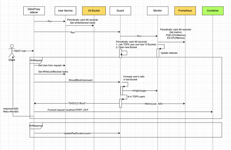
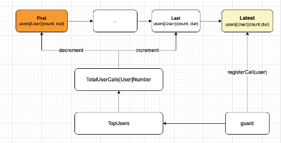

# Introduction

There are many DDOS solutions on the market to protect RESTAPI services. 
Major part of the existing solutions based on the user's rate limit. Our services are not opened to the public domain. 
We have numerous groups of internal users (or faceless accounts) which use the services. It's nightmare to manage
the rate limits of all categories of the users: 

- What is the "right" quota for today?
- Use rate limit by day/hour/minute/second?
- By user only or per API or service?
- How manage all this stuff? xsl? UI?

We want to continue to provide the service to the company even the system in the stress. Ideally, we want to 
identify that the system is under the stress (ddos attack) and at the first step scale up the services (increase the 
number of running in instances). But, usually, services use some Database or any other resources which became
the bottleneck in case the service scale up. Therefore, we want to monitor the external resources of the service
to prevent ddos of resource. Our DDOS guard should start filter (return http status 429) for TopN heavy users on the stress.

Our DDOS guard is implemented as k8s side container. It provides standalone protection for the underling container. 
It can use Prometheus and CloudWatch service to monitor the container's resources (cpu/memory etc) and other cluster's services 
and resources.


# Implementation

Our implementation, is based on [goproxy](https://github.com/elazarl/goproxy) package. 

The basic flow can be described as the following:

- Get http request
- Extract the user from JWT token. If the system is under attack and the user in the TopN user list - return 429
- Update the user call statistics: calls count and duration
- The ddos guard support *white* and *blocked* user lists, which can be defined as part of the configuration or in S3 bucket 
(the file from S3 is refreshed according configuration interval).
- The TopN users are calculated based on these two measurement: calls count and duration. The user's statistics are stored
in the time bucket. The bucket duration and history size are defined in the configuration file. The TopN users calculation 
process is running in background thread and is not a part of the request/response process.
- The background thread is periodically monitoring the resources (Prometheus and CloudWatch queries) of the protected container.
In case, the one of then is greater than *UpperBound* value (specified by the configuration) the guard should start to filter
upcoming requests. (Note: if for any reason the query can't be executed, the monitor does not take it into account).
Only TopN users requests will be filtered on the stress. The guard, will begin with filtering of 10% of the requests. 
If this will not help, the filtering will be increased to 20%, 30% and so on. And the otherwise, the filter ration will be
decreased by 10% each time, in case the system behavior back to normal.


## Component
### Proxy
Main entry of the DDOS guard. It listen for requests on *PortIn* port and forwards them to the *PortIn* underling container port.
The guard exposes two its own endpoints:
- health - the ddos guard health check
- metrics - prometheus metrics endpoint (see Collector)
It uses the Guard component to get TopN users for filtering in case "the system under the stress".



### Guard
The *Guard* manages the users statistics to provide the TopN users to the *Proxy*. The statistics are stored in the time based buckets.
The background thread, once a time, remove the oldest bucket (according to the configuration) and re-calculates the TopN users list.
Thus, the TopN users list is always available for the proxy and no additional effort spends on the incoming request processing.



### Monitor
Periodically runs in the background thread the provided Prometheus and CloudWatch queries to validate healthy status of the system.
In case, one of the query's value is greater than *UpperBound* - the *InHighUsage* flag is raised.

### Collector
The DDOS guard exposes the following prometheus metrics:
- Counter *ddos_user_blocked* - blocked users by the guard
- Gauge *ddos_guard_status* - DDOS guard status, 0 - Ok, otherwise the index of the query for the "stress" reason

### UserService
Manage *white* and *blocked* user lists. If the users defined in S3 bucket - pooling the changes according the *UserService.RefreshPeriod*
configuration value.

## Configuration
The DDOS guard configuration file should be placed under `/etc/ddos-guard/ddos-guard.json` inside the container. 

### Proxy section
```json
{
    "Proxy": {
        "PortIn": 8081,
        "PortOut": 8080,
        "HostOut": "localhost",
        "RetryAfter": 60,
        "HealthPath": "/ddos-guard-health",
        "MetricsPath": "/ddos-guard-metrics"
    }
}
```

### UserService section
Provides configuration to manage *white* and *blocked* user lists. The lists can be provided as a part of the configuration,
or pooling periodically from S3 bucket. The AWS [enviroment varibles](https://docs.aws.amazon.com/cli/latest/userguide/cli-configure-envvars.html) 
or `ServiceAccount` can be used to provide access to S3 bucket,

```json
{
    "UserService": {
        "RefreshPeriod": "60s",
        "WhiteListUsers": [],
        "BlockedListUsers": [],
        "S3Bucket": "my-bucket",
        "S3Path": "ddos/users.json"
    }
}
```

Sample of `users.json`:
```json
{
    "WhiteListUsers": [
        "test1_white",
        "test2_white"
    ],
    "BlockedListUsers": [
        "test_blocked"
    ]
}
```

### Monitoring section
Defines Prometheus and CloudWatch queries to identify "system under the stress" case.
You can use environment variables inside the query. For example, you can use `${MY_POD_NAME}` k8s Pod's name to
parametrize query to get container's CPU and Memory usage:

```yaml
    env:
    - name: MY_POD_NAME
        valueFrom:
        fieldRef:
            apiVersion: v1
            fieldPath: metadata.name
```

```json
{
    "Monitoring": {
        "MetricsPeriodSeconds": 30,
        "PrometheusQueries": {
            "ElasticCPU": {
                "Query": "sum(elasticsearch_process_cpu_percent{job='elasticsearch-metrics',cluster='elastic',name=~'elasticsearch-data-.*'} ) / count (elasticsearch_process_cpu_percent{job='elasticsearch-metrics',cluster='elastic',name=~'elasticsearch-data-.*'})",
                "UpperBound": 90.0
            },
            "ElasticMemory": {
                "Query": "sum(elasticsearch_jvm_memory_used_bytes{job='elasticsearch-metrics',cluster='elastic',name=~'elasticsearch-data-.*'}) / sum (elasticsearch_jvm_memory_max_bytes{job='elasticsearch-metrics',cluster='elastic',name=~'elasticsearch-data-.*'}) * 100",
                "UpperBound": 90.0
            },
            "PodCPU": {
                "Query": "avg(node_namespace_pod_container:container_cpu_usage_seconds_total:sum_irate{pod='${MY_POD_NAME}'}) / avg(cluster:namespace:pod_cpu:active:kube_pod_container_resource_limits{pod='${MY_POD_NAME}'}) * 100",
                "UpperBound": 90.0
            },
            "PodMemory": {
                "Query": "avg(container_memory_working_set_bytes{job='kubelet', metrics_path='/metrics/cadvisor', pod='${MY_POD_NAME}', container!='', image!=''}) / avg(cluster:namespace:pod_memory:active:kube_pod_container_resource_limits{pod='${MY_POD_NAME}'}) * 100",
                "UpperBound": 90.0
            },
            "RequestDuration": {
                "Query": "sum(increase(gonic_request_duration_sum{pod='${MY_POD_NAME}'}[1m])) / sum(increase(gonic_request_duration_count{pod='${MY_POD_NAME}'}[1m]))",
                "UpperBound": 10.0
            }
        },
        "CloudWatchQueries": {
            "RDSCPU": {
                "Namespace": "AWS/RDS",
                "Metric": "CPUUtilization",
                "DimensionName": "DBInstanceIdentifier",
                "DimensionValue": "prd-mysql8",
                "UpperBound": 90.0
            }
        }
    }
}
```

### Guard section
Provides configuration for *Guard* component to manage user's statistic buckets and TopN user lists.

```json
{
    "Guard": {
        "BucketDuration": "60s",
        "BucketsHistory": 10,
        "TopUserCount": 3,
        "FilterRatioStep": 10
    }
}
```

### Prometheus section (Optional)
Provides Prometheus server address and credentials (just omit 8Username* in case yous Prometheus does not have authentication).
If your prometheus runs inside the k8s cluster, you can provide the internal one: `http://kube-prometheus-stack-prometheus.kube-prometheus-stack.svc.cluster.local:9090`

```json
{
    "Prometheus": {
        "Url": "http://prometheus.my.com",
        "Username": "user",
        "Password": "psw"
    }
}
```

## Environment variables
You can override the configuration from the `ddos-guard.json` file using the following environment variables:

```bash
PORT_IN="8081"
HOST_OUT="localhost"
PORT_OUT="8080"
RETRY_AFTER="60"
MY_POD_NAME="pod-1234"
BYPASS="false"
```

`BYPASS` provides fast solution to skip ddos guard logic in case of unexpected behavior or bugs.

## Deployment
You can find the latest docker image of the ddos guard in [Docker Hub](https://hub.docker.com/repository/docker/yukels97/ddos-guard)
repository. The [Dockerfile](ddos-guard/Dockerfile) based on *Alpine Linux* image and was compiled for two platforms: Mac and Linux
(linux/amd64, linux/arm64).

You can find under the [deploy](test/deploy) folder sample of deployment to AWS kubernetes cluster. 
> **_NOTE:_**  If you are using k8s HPA, you should specify the value of *targetCPUUtilizationPercentage* smaller than
the *UpperBound* value of *PodCPU* query (in th example 80 and 90, respectively).


